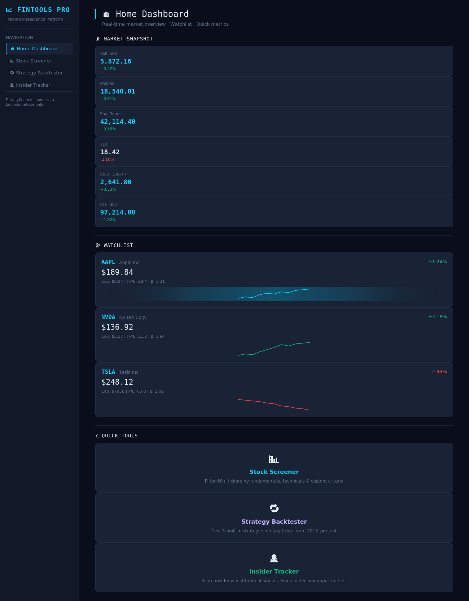
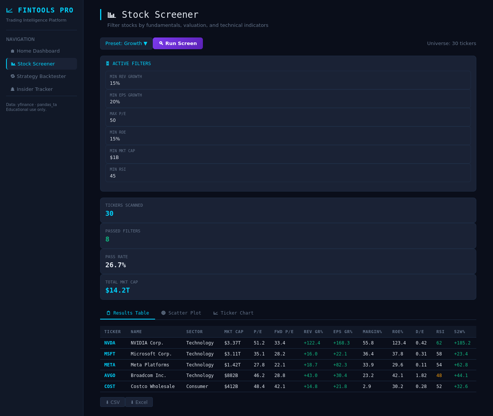
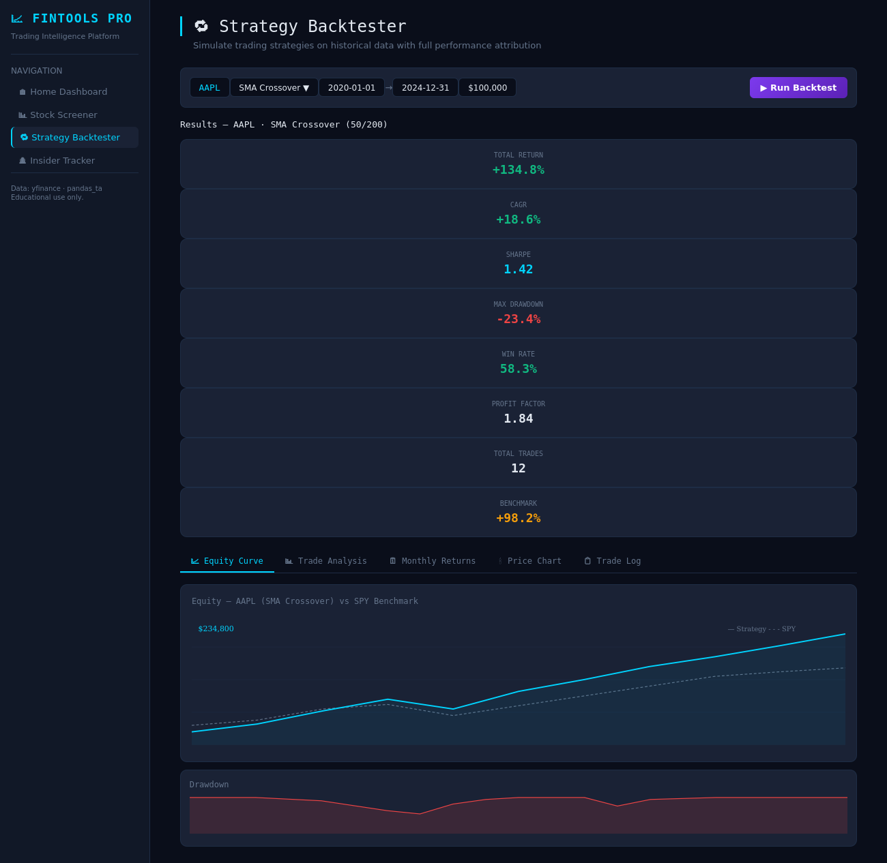
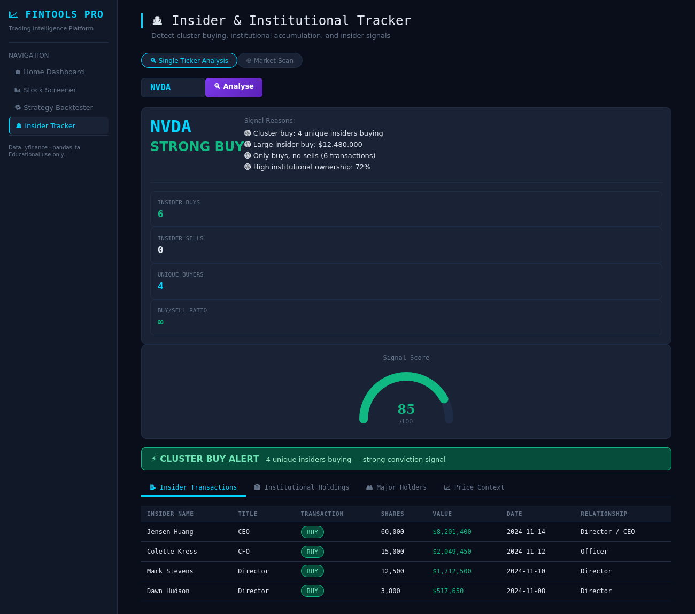

# FinTools Pro

## For a data analyst application

**Supporting equity-research dashboard.** Screening, a backtest, and ownership prints in one board. Useful for a markets analyst conversation. It repeats the finance-dashboard pattern, so it should not be the first link you send.

A Streamlit equity research app: a current fundamental and technical screen, a daily long/flat backtest, and insider-filing review. Market data comes from yfinance. No API key is required.

The screenshots are interface previews. They are not an audited track record, and this README does not quote performance numbers.

## Modules

| Module | What it does |
|---|---|
| Home | Latest daily closes and a watchlist. Not a live tick feed. |
| Stock screener | Filters a static ticker list on the latest vendor snapshot. Missing values fail the filter. |
| Strategy backtester | SMA, EMA, RSI, MACD, and Bollinger signals. Fills at the next open. |
| Insider filings | Scores purchases and sales only after a public date. Institutional rows are shown, not backtested. |

## Backtest rules

- A signal on bar t may use that bar's close. The order is filled at the **next session's open**. The same bar's move is not credited.
- Prices are split-adjusted (`auto_adjust=True`).
- Commission and slippage are fractions of traded notional and are charged when the position changes. The default in `config.py` is 0.1% commission and 0.1% slippage per fill. Position fraction scales how much of capital is long; the rest earns zero.
- Total return and CAGR are compounded. CAGR, Sharpe, and Sortino use 252 trading days. Sharpe and Sortino are left blank when volatility or downside deviation is zero. They are not reported as infinity.
- The last open is not marked, because there is no following open. A signal on the final bar is not filled.
- Closed trades are round trips. A position still open at the end stays in the equity curve and is not counted as a win or a loss.
- Alpha and beta are implemented for a caller-supplied benchmark series (daily Jensen alpha, rf = 0, annualized by × 252). The page does not download a benchmark, so it does not display alpha or beta.

## Filings and fundamentals

- Insider rows from yfinance carry a transaction date and usually no filing date. Form 4 is due within two business days, so a missing filing date is treated as public then. Weekends are skipped. Exchange holidays are not. A real filing date is used when the feed has one. A filing stamp earlier than the transaction is ignored.
- The insider score is a description of filings already public on the as-of date (unique buyers, unique sellers, and a cluster of three or more buyers). It is not a return forecast. Institutional holdings are not an input.
- The screener uses the latest Yahoo snapshot. That snapshot is not a historical filing. `latest_released` will not accept a `period_end` in place of an `available_date`, so an unreported quarter cannot be treated as known.
- Field units from the current quote summary: dividend yield is already a percent (2.43 means 2.43%). ROE, margins, growth, and payout ratio are fractions and are stored as percents. Debt/equity is Yahoo's percent figure divided by 100. A blank insider row, or a "Stock Gift", is not counted as a purchase.
- A 13F is due 45 days after quarter end. The institutional table is the latest vendor snapshot and is not a backtest. Do not treat the quarter-end date as the public date.

## Survivorship bias

`SP500_SAMPLE` and the home watchlist are **names that are listed today**. Delisted companies are absent. This is not point-in-time S&P 500 membership, and it is not fixed in code: a true fix needs a historical constituent tape, which this app does not have. Any screen on this list is conditioned on survival. The backtester itself is single-name, so index survivorship does not enter a one-ticker simulation, but the menu of tickers you can pick still excludes the dead ones.

`TWTR` was removed from the watchlist choices because that listing is gone, and `SQ` was replaced with `XYZ`. That cleanup is not a survivorship correction.

## Run locally

~~~bash
git clone https://github.com/ParBproject/-Stock-Screener-Strategy-Backtester-Insider-Institutional-Signal-Tracker-.git
cd ./-Stock-Screener-Strategy-Backtester-Insider-Institutional-Signal-Tracker-

python -m venv .venv
source .venv/bin/activate
pip install -r requirements.txt
streamlit run app.py
~~~

Open http://localhost:8501.

Tests (network is mocked):

~~~bash
pip install pytest
python -m pytest -q
~~~

## API keys

yfinance does not need a key. Do not put tokens in source. `.env` and `.streamlit/secrets.toml` are gitignored. `.env.example` shows the empty pattern. `utils.secrets.get_secret` reads the environment, then a local `.env`, then Streamlit secrets.

## Repository structure

~~~text
.
├── app.py
├── config.py
├── modules/
│   ├── backtester.py
│   ├── fundamentals.py
│   ├── insider.py
│   ├── performance.py
│   └── screener.py
├── utils/
│   ├── charts.py
│   ├── data_fetcher.py
│   ├── indicators.py
│   └── secrets.py
├── pages/
├── tests/
├── requirements.txt
└── .github/workflows/ci.yml
~~~

Indicators are causal rolling and EWM calculations in `utils/indicators.py`, which is what the tests check. `pandas-ta` is not used.

## Skills demonstrated

Python, financial-data integration, factor screening, technical indicators, historical backtesting, risk metrics, Streamlit, Plotly, and tests around execution and filing dates.

## Responsible use

Educational and research use only. This is not financial advice. Historical fills and filing activity do not predict future returns. Vendor data can be delayed, missing, or revised. Yahoo's insider feed often has no filing timestamp, and the two-business-day lag is a deadline, not the exchange's holiday calendar.
